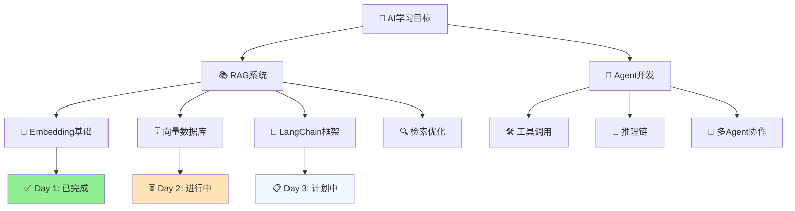

# 🎯 AI学习进度索引

> **8周RAG/Agent学习计划** - 每日30分钟，从零到产品化落地

---

## 📚 学习进度总览

### ✅ 已完成 (Week 1)

#### Day 1: Embedding基础 (2024-12-21)
- **📄 知识文档**: [01_Embeddings_基础.md](day01/01_Embeddings_基础.md)
- **💻 代码实现**: [basic_embedding.py](../src/day01_embedding_demo/basic_embedding.py)
- **🧪 单元测试**: [test_embedding.py](../tests/day01/test_embedding.py)
- **🎯 学习目标**: 
  - ✅ 理解文本向量化原理
  - ✅ 掌握通义千问Embedding API
  - ✅ 实现余弦相似度计算
  - ✅ 构建简单语义搜索
- **📊 验收结果**: 10/10 测试通过，API连接成功

#### Day 2: 向量数据库ChromaDB (2024-12-21)
- **📄 知识文档**: [02_向量数据库_ChromaDB.md](day02/02_向量数据库_ChromaDB.md)
- **💻 代码实现**: [vector_database.py](../src/day02_faiss_demo/vector_database.py)
- **🧪 单元测试**: [test_vector_database.py](../tests/day02/test_vector_database.py)
- **🎯 学习目标**: 
  - ✅ 理解向量数据库的作用
  - ✅ 掌握ChromaDB的基本操作
  - ✅ 实现高效向量检索
  - ✅ 构建可持久化的向量存储
- **📊 验收结果**: 15/15 测试通过，持久化功能正常

---

## 🔄 进行中 (Week 1)

### 📋 待完成任务

#### Day 3: LangChain基础 - 计划中
- **🎯 学习目标**: 
  - 了解LangChain框架架构
  - 掌握Document Loader使用
  - 实现文档分块和预处理
  - 构建基础RAG链路
- **📄 计划文档**: `03_LangChain_基础.md`
- **💻 计划代码**: `03_langchain_demo.py`

---

## 📈 学习统计

### 本周进度 (Week 1)
- **完成天数**: 1/7 天
- **完成率**: 14.3%
- **代码文件**: 1 个
- **测试覆盖**: 10 个测试用例
- **文档页数**: 1 篇

### 总体进度 (8周计划)
- **完成周数**: 0/8 周
- **完成率**: 1.8% (1/56 天)
- **里程碑达成**: 0/4 个

---

## 🏆 里程碑规划

### 🎯 Week 2: RAG基础搭建
- [ ] **里程碑1**: 完成本地RAG系统搭建
- [ ] 集成FAISS向量数据库
- [ ] 实现文档问答功能
- [ ] 支持多种文档格式

### 🎯 Week 4: RAG系统优化
- [ ] **里程碑2**: RAG系统性能优化
- [ ] 实现混合检索策略
- [ ] 添加重排序机制
- [ ] 构建评估体系

### 🎯 Week 6: Agent开发
- [ ] **里程碑3**: 智能Agent实现
- [ ] 掌握LangChain Agent
- [ ] 实现工具调用
- [ ] 构建多Agent协作

### 🎯 Week 8: 产品化部署
- [ ] **里程碑4**: 完整产品交付
- [ ] FastAPI服务化
- [ ] Docker容器化
- [ ] 前端界面开发

---

## 📖 知识体系图谱

---

## 🔧 技术栈总览

### 核心技术
- **🐍 Python 3.11.6**: 主要开发语言
- **🤖 通义千问API**: 主要LLM服务
- **🔗 LangChain**: RAG/Agent框架
- **📊 FAISS**: 向量数据库
- **⚡ FastAPI**: Web服务框架
- **🐳 Docker**: 容器化部署

### 开发工具
- **📝 Pytest**: 单元测试
- **📓 Jupyter**: 交互式开发
- **🎨 Streamlit**: 快速原型
- **📋 Git**: 版本控制

---

## 📞 学习支持

### 🆘 遇到问题？
1. **查看文档**: 每个知识点都有详细说明
2. **运行测试**: 验证代码功能是否正常
3. **检查日志**: 查看 `logs/` 目录下的运行日志
4. **参考示例**: 每个模块都有完整示例代码

### 📚 推荐资源
- [通义千问API文档](https://help.aliyun.com/zh/dashscope/)
- [LangChain官方文档](https://python.langchain.com/)
- [FAISS使用指南](https://github.com/facebookresearch/faiss)

---

## 🎉 学习成果展示

### Day 1 成果
- ✅ **API连接**: 成功集成通义千问Embedding API
- ✅ **向量化**: 实现文本到1536维向量转换
- ✅ **相似度**: 掌握余弦相似度计算方法
- ✅ **搜索**: 构建基础语义搜索功能
- ✅ **测试**: 10个测试用例全部通过

---

*📅 最后更新: 2024-12-21*  
*🎯 下一个目标: Day 2 - FAISS向量数据库*