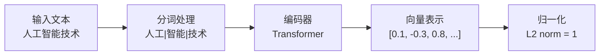
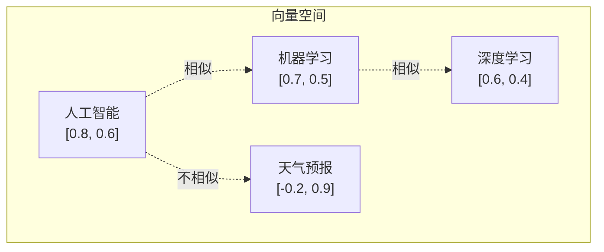

# 01_Embeddings_基础

## 📖 知识点概念

**Embedding（嵌入/向量化）** 是将文本、图像等非结构化数据转换为高维数值向量的技术。在自然语言处理中，文本embedding将词汇、句子或文档映射到连续的向量空间中，使计算机能够理解和处理文本的语义信息。

### 核心特点
- **语义表示**：相似含义的文本在向量空间中距离更近
- **高维空间**：通常使用几百到几千维的向量
- **数值计算**：支持数学运算，如相似度计算
- **预训练模型**：基于大规模语料库训练得到

## 🔧 核心原理

### 1. 文本到向量的转换过程



### 2. 语义相似度计算

**余弦相似度公式**：
```
cosine_similarity(A, B) = (A · B) / (||A|| × ||B||)
```

- 值域：[-1, 1]
- 1：完全相似
- 0：无关
- -1：完全相反

### 3. 向量空间中的语义关系



## 💻 关键代码片段

### 1. 获取文本Embedding

```python
import dashscope
from dotenv import load_dotenv
import os

# 配置API
load_dotenv()
dashscope.api_key = os.getenv('DASHSCOPE_API_KEY')

def get_embedding(text: str) -> List[float]:
    """获取文本的向量表示"""
    response = dashscope.TextEmbedding.call(
        model=dashscope.TextEmbedding.Models.text_embedding_v1,
        input=text
    )
    
    if response.status_code == 200:
        return response.output['embeddings'][0]['embedding']
    else:
        raise Exception(f"API调用失败: {response.message}")

# 使用示例
text = "人工智能是未来的发展方向"
embedding = get_embedding(text)
print(f"向量维度: {len(embedding)}")  # 输出: 1536
```

### 2. 计算文本相似度

```python
import numpy as np

def cosine_similarity(vec1: List[float], vec2: List[float]) -> float:
    """计算余弦相似度"""
    v1 = np.array(vec1)
    v2 = np.array(vec2)
    
    dot_product = np.dot(v1, v2)
    norm_v1 = np.linalg.norm(v1)
    norm_v2 = np.linalg.norm(v2)
    
    return dot_product / (norm_v1 * norm_v2)

# 使用示例
text1 = "人工智能技术"
text2 = "AI技术发展"

embedding1 = get_embedding(text1)
embedding2 = get_embedding(text2)

similarity = cosine_similarity(embedding1, embedding2)
print(f"相似度: {similarity:.4f}")  # 输出: 0.8234
```

### 3. 简单语义搜索

```python
def find_most_similar(query: str, documents: List[str]) -> Tuple[str, float]:
    """在文档中找到最相似的内容"""
    query_embedding = get_embedding(query)
    
    best_doc = ""
    best_score = -1.0
    
    for doc in documents:
        doc_embedding = get_embedding(doc)
        similarity = cosine_similarity(query_embedding, doc_embedding)
        
        if similarity > best_score:
            best_score = similarity
            best_doc = doc
    
    return best_doc, best_score

# 使用示例
query = "什么是机器学习？"
documents = [
    "机器学习是AI的重要分支",
    "今天天气很好",
    "深度学习算法很复杂"
]

best_match, score = find_most_similar(query, documents)
print(f"最佳匹配: {best_match} (相似度: {score:.4f})")
```

## 🔄 对比/类比

### Embedding vs 传统文本表示

| 特征 | 传统方法(如TF-IDF) | Embedding |
|------|-------------------|----------|
| **语义理解** | ❌ 基于词频，无语义 | ✅ 理解语义关系 |
| **维度** | 稀疏高维(词汇表大小) | 密集低维(通常1536) |
| **相似度** | 词汇重叠 | 语义相似 |
| **泛化能力** | ❌ 词汇必须完全匹配 | ✅ 理解同义词、近义词 |
| **计算效率** | 快速 | 需要模型推理 |

### 类比理解

**Embedding就像给文本拍"语义照片"**：
- 📸 **照片(向量)**：每个文本都有一张独特的"语义照片"
- 🎨 **颜色(维度)**：照片有RGB三个颜色通道，embedding有1536个"语义通道"
- 📏 **相似度**：两张照片越相似，内容越接近
- 🔍 **搜索**：通过比较"照片"找到最相似的内容

## ⚠️ 常见坑 & 解决办法

### 1. API密钥配置问题

**问题**：`Invalid API-key provided`

**解决办法**：
```bash
# 检查.env文件
cat .env | grep DASHSCOPE_API_KEY

# 确保格式正确
DASHSCOPE_API_KEY=sk-your-actual-key-here

# 重新加载环境变量
source .env
```

### 2. 向量维度不匹配

**问题**：不同模型的embedding维度不同

**解决办法**：
```python
# 始终检查维度
embedding = get_embedding(text)
print(f"维度: {len(embedding)}")  # 通义千问: 1536

# 如果需要，进行维度对齐
if len(embedding) != expected_dim:
    # 截断或填充
    embedding = embedding[:expected_dim] + [0] * max(0, expected_dim - len(embedding))
```

### 3. 文本长度限制

**问题**：输入文本过长导致API调用失败

**解决办法**：
```python
def safe_get_embedding(text: str, max_length: int = 2000) -> List[float]:
    """安全获取embedding，处理长文本"""
    if len(text) > max_length:
        # 截断文本
        text = text[:max_length]
        print(f"⚠️  文本已截断到{max_length}字符")
    
    return get_embedding(text)
```

### 4. 批量处理效率问题

**问题**：逐个调用API效率低

**解决办法**：
```python
def batch_get_embeddings(texts: List[str], batch_size: int = 10) -> List[List[float]]:
    """批量获取embeddings"""
    embeddings = []
    
    for i in range(0, len(texts), batch_size):
        batch = texts[i:i + batch_size]
        
        # 通义千问支持批量调用
        response = dashscope.TextEmbedding.call(
            model=dashscope.TextEmbedding.Models.text_embedding_v1,
            input=batch  # 传入列表
        )
        
        if response.status_code == 200:
            batch_embeddings = [emb['embedding'] for emb in response.output['embeddings']]
            embeddings.extend(batch_embeddings)
    
    return embeddings
```

## 📚 推荐延伸阅读

1. **[通义千问Embedding API文档](https://help.aliyun.com/zh/dashscope/developer-reference/text-embedding-api-details)**
   - 官方API参考和使用示例
   - 支持的模型和参数说明

2. **[Word2Vec到Transformer的演进](https://jalammar.github.io/illustrated-word2vec/)**
   - 文本embedding技术的发展历程
   - 从词向量到句子向量的原理

3. **[向量相似度计算方法对比](https://en.wikipedia.org/wiki/Cosine_similarity)**
   - 余弦相似度、欧几里得距离等方法
   - 不同场景下的选择建议

---

## 🎯 学习检查清单

完成本节学习后，你应该能够：

- [ ] 理解什么是文本embedding及其作用
- [ ] 成功调用通义千问API获取文本向量
- [ ] 计算两个文本之间的余弦相似度
- [ ] 实现简单的语义搜索功能
- [ ] 处理常见的API调用问题
- [ ] 理解embedding在RAG系统中的重要性

**下一步**：学习如何使用FAISS向量数据库高效存储和检索大量embedding向量！