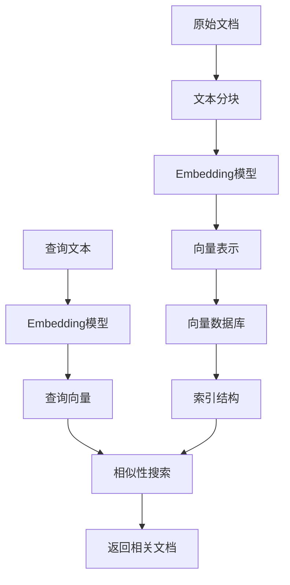

# 02_向量数据库_ChromaDB

## 📚 核心概念

**向量数据库（Vector Database）** 是专门用于存储、索引和查询高维向量数据的数据库系统。它是RAG（检索增强生成）系统的核心组件，负责高效地进行语义相似性搜索。

### 关键特性
- **高维向量存储**：存储文本、图像等转换后的向量表示
- **相似性搜索**：基于余弦相似度、欧几里得距离等进行快速检索
- **元数据支持**：存储与向量关联的原始文档和元信息
- **持久化存储**：支持数据持久化和跨会话访问
- **水平扩展**：支持大规模数据的分布式存储和查询

## 🔧 核心原理

### 1. 向量存储与索引


### 2. 相似性搜索流程
1. **向量化查询**：将用户查询转换为向量
2. **索引搜索**：在向量索引中快速定位候选向量
3. **相似度计算**：计算查询向量与候选向量的相似度
4. **结果排序**：按相似度降序返回Top-K结果
5. **元数据关联**：返回原始文档内容和元数据

## 💻 关键代码片段

### 1. ChromaDB初始化
```python
import chromadb
from chromadb.config import Settings

# 创建持久化客户端
client = chromadb.PersistentClient(
    path="./chroma_db",
    settings=Settings(anonymized_telemetry=False)
)

# 获取或创建集合
collection = client.get_or_create_collection(
    name="documents",
    metadata={"hnsw:space": "cosine"}  # 使用余弦相似度
)
```

### 2. 文档添加与向量化
```python
def add_documents(self, documents, metadatas=None):
    """添加文档到向量数据库"""
    # 生成文档ID
    doc_ids = [f"doc_{int(time.time() * 1000000)}_{i}" 
               for i in range(len(documents))]
    
    # 获取文档向量
    embeddings = []
    for doc in documents:
        embedding = self.embedding_demo.get_embedding(doc)
        embeddings.append(embedding)
    
    # 添加到ChromaDB
    self.collection.add(
        documents=documents,
        embeddings=embeddings,
        metadatas=metadatas or [{} for _ in documents],
        ids=doc_ids
    )
    
    return doc_ids
```

### 3. 相似性搜索
```python
def search_similar(self, query, n_results=5):
    """搜索相似文档"""
    # 向量化查询
    query_embedding = self.embedding_demo.get_embedding(query)
    
    # 执行搜索
    results = self.collection.query(
        query_embeddings=[query_embedding],
        n_results=n_results,
        include=['documents', 'metadatas', 'distances']
    )
    
    # 格式化结果
    formatted_results = []
    for i, doc in enumerate(results['documents'][0]):
        similarity = 1 - results['distances'][0][i]  # 转换距离为相似度
        formatted_results.append({
            'document': doc,
            'similarity': similarity,
            'metadata': results['metadatas'][0][i]
        })
    
    return formatted_results
```

### 4. 集合统计信息
```python
def get_collection_stats(self):
    """获取集合统计信息"""
    try:
        count = self.collection.count()
        return {
            'total_documents': count,
            'database_type': 'ChromaDB',
            'collection_name': self.collection.name,
            'persist_directory': self.persist_directory
        }
    except Exception as e:
        return {
            'total_documents': 0,
            'database_type': 'ChromaDB',
            'error': str(e)
        }
```

## 🆚 对比分析

### ChromaDB vs 其他向量数据库

| 特性 | ChromaDB | FAISS | Pinecone | Milvus |
|------|----------|-------|----------|--------|
| **部署方式** | 本地/嵌入式 | 本地库 | 云服务 | 分布式 |
| **学习成本** | 低 | 中 | 低 | 高 |
| **性能** | 中等 | 高 | 高 | 很高 |
| **持久化** | ✅ | ❌ | ✅ | ✅ |
| **元数据支持** | ✅ | ❌ | ✅ | ✅ |
| **成本** | 免费 | 免费 | 付费 | 开源/付费 |
| **适用场景** | 原型开发 | 高性能计算 | 生产环境 | 大规模部署 |

### 传统数据库 vs 向量数据库

| 维度 | 传统数据库 | 向量数据库 |
|------|------------|------------|
| **数据类型** | 结构化数据 | 高维向量 |
| **查询方式** | 精确匹配/SQL | 相似性搜索 |
| **索引结构** | B树/哈希 | HNSW/IVF |
| **应用场景** | 事务处理 | 语义搜索/推荐 |
| **查询复杂度** | O(log n) | O(log n) ~ O(n) |

## ⚠️ 常见坑点与解决方案

### 1. 向量维度不匹配
```python
# ❌ 错误：不同模型的向量维度不同
embedding1 = openai_model.embed("text")  # 1536维
embedding2 = qwen_model.embed("text")    # 1536维
# 混用可能导致搜索结果异常

# ✅ 解决：统一使用同一个embedding模型
class VectorDatabaseDemo:
    def __init__(self):
        self.embedding_demo = EmbeddingDemo()  # 固定使用一个模型
```

### 2. 内存占用过大
```python
# ❌ 错误：一次性加载大量文档
documents = load_million_documents()  # 可能导致内存溢出
db.add_documents(documents)

# ✅ 解决：批量处理
batch_size = 100
for i in range(0, len(documents), batch_size):
    batch = documents[i:i + batch_size]
    db.add_documents(batch)
    time.sleep(0.1)  # 避免API限流
```

### 3. 相似度阈值设置
```python
# ❌ 错误：没有设置相似度阈值
results = db.search_similar(query, n_results=10)
# 可能返回不相关的文档

# ✅ 解决：设置合理的相似度阈值
results = db.search_similar(query, n_results=10)
filtered_results = [
    r for r in results 
    if r['similarity'] > 0.7  # 设置阈值
]
```

### 4. 元数据查询优化
```python
# ❌ 错误：没有利用元数据过滤
results = db.search_similar("Python编程", n_results=100)
# 然后在应用层过滤category="编程"

# ✅ 解决：在数据库层面过滤（如果支持）
results = collection.query(
    query_embeddings=[query_embedding],
    n_results=10,
    where={"category": "编程"}  # 数据库层面过滤
)
```

### 5. 持久化配置问题
```python
# ❌ 错误：没有正确配置持久化路径
client = chromadb.Client()  # 内存模式，重启后数据丢失

# ✅ 解决：使用持久化客户端
client = chromadb.PersistentClient(
    path="./vector_db",
    settings=Settings(
        anonymized_telemetry=False,
        allow_reset=True
    )
)
```

## 📖 推荐延伸阅读

1. **ChromaDB官方文档**：https://docs.trychroma.com/
   - 详细的API文档和最佳实践
   - 高级功能如过滤、更新、删除操作

2. **向量数据库对比分析**：https://zilliz.com/blog/what-is-a-vector-database
   - 不同向量数据库的性能对比
   - 选型指南和使用场景分析

3. **通义千问Embedding API文档**：https://help.aliyun.com/zh/dashscope/
   - API调用限制和最佳实践
   - 不同embedding模型的特点对比

## ✅ 学习检查清单

- [ ] 理解向量数据库的核心概念和应用场景
- [ ] 掌握ChromaDB的基本操作（增删改查）
- [ ] 了解相似性搜索的原理和实现
- [ ] 学会处理元数据和文档关联
- [ ] 掌握批量操作和性能优化技巧
- [ ] 了解持久化配置和数据管理
- [ ] 能够进行向量数据库的选型和对比
- [ ] 掌握常见问题的调试和解决方法

## 🎯 实战要点

1. **选择合适的向量数据库**：根据项目规模和需求选择
2. **优化embedding策略**：统一模型，合理分块
3. **设计合理的元数据结构**：便于后续过滤和管理
4. **监控性能指标**：查询延迟、内存使用、存储空间
5. **建立备份策略**：定期备份向量数据和索引

---

**下一步学习目标**：Day 3 - LangChain基础与RAG系统集成