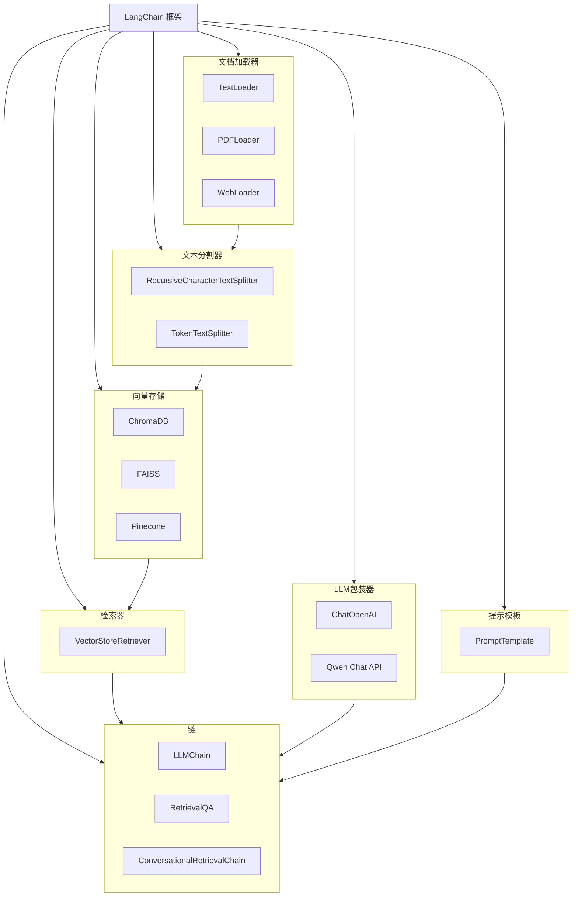
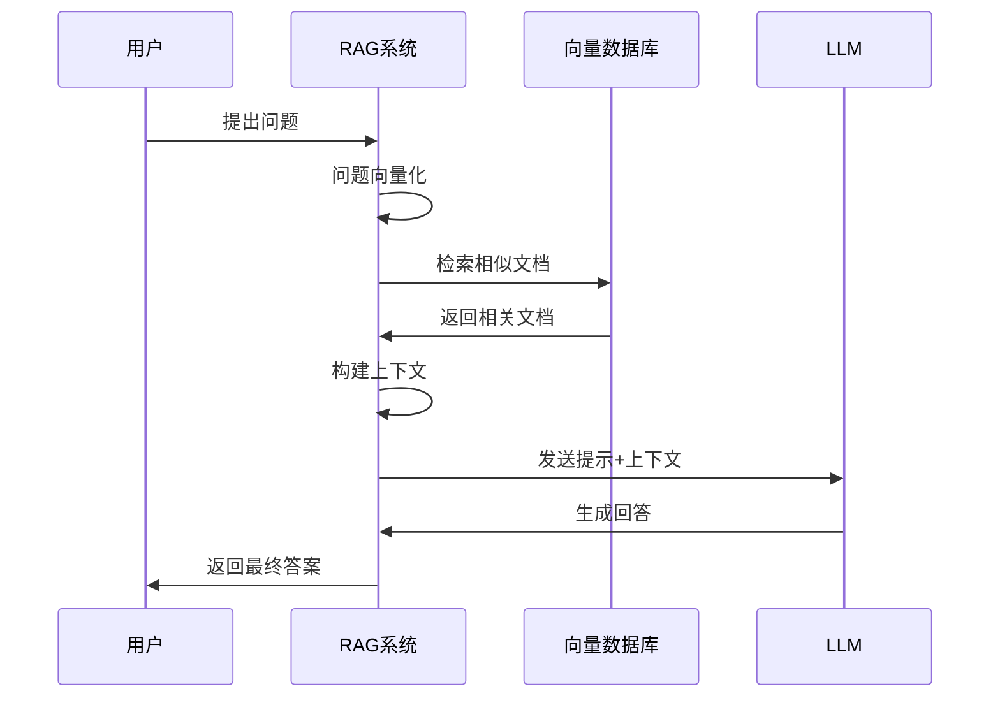

# 03_LangChain框架与RAG系统

## 📚 核心概念

### LangChain框架
LangChain是一个用于构建基于大语言模型(LLM)应用的开源框架，它提供了丰富的组件和工具，简化了AI应用的开发过程。

### RAG系统 (Retrieval-Augmented Generation)
RAG是一种结合信息检索和文本生成的AI技术，通过检索相关知识来增强生成模型的回答质量。

## 🔧 核心组件

### 1. LangChain核心组件



### 2. RAG系统架构



## 💻 关键代码片段

### 1. LangChain文本分割器

```python
from langchain.text_splitter import RecursiveCharacterTextSplitter

# 创建文本分割器
text_splitter = RecursiveCharacterTextSplitter(
    chunk_size=500,          # 每个块的最大字符数
    chunk_overlap=50,        # 块之间的重叠字符数
    separators=["\n\n", "\n", "。", "！", "？", ";", "，", " ", ""]
)

# 分割文本
chunks = text_splitter.split_text(long_text)
```

### 2. 自定义LLM包装器

```python
from langchain_community.llms.base import LLM
from typing import Optional, List

class QwenLLM(LLM):
    """通义千问LLM包装器"""
    
    @property
    def _llm_type(self) -> str:
        return "qwen"
    
    def _call(self, prompt: str, stop: Optional[List[str]] = None) -> str:
        # 调用通义千问API
        response = Generation.call(
            model="qwen-turbo",
            prompt=prompt,
            max_tokens=1000,
            temperature=0.7
        )
        return response.output.text.strip()
```

### 3. RAG提示模板

```python
from langchain.prompts import PromptTemplate

prompt_template = PromptTemplate(
    input_variables=["context", "question"],
    template="""
基于以下上下文信息，请回答用户的问题。如果上下文中没有相关信息，请说明无法从提供的信息中找到答案。

上下文信息：
{context}

用户问题：{question}

请提供详细和准确的回答：
"""
)
```

### 4. 完整RAG查询流程

```python
def query(self, question: str, top_k: int = 3) -> Dict[str, Any]:
    """完整的RAG查询流程"""
    # 1. 检索相关文档
    retrieved_docs = self.retrieve_documents(question, top_k=top_k)
    
    # 2. 构建上下文
    context_parts = []
    for i, doc in enumerate(retrieved_docs, 1):
        context_parts.append(f"文档{i}: {doc['document']}")
    context = "\n\n".join(context_parts)
    
    # 3. 生成提示
    prompt = self.prompt_template.format(context=context, question=question)
    
    # 4. 调用LLM生成回答
    answer = self.llm._call(prompt)
    
    return {
        'question': question,
        'answer': answer,
        'retrieved_docs': retrieved_docs,
        'retrieval_time': retrieval_time,
        'generation_time': generation_time,
        'total_time': total_time
    }
```

## 🆚 对比分析

### RAG vs 传统问答系统

| 特性 | 传统问答 | RAG系统 |
|------|----------|----------|
| 知识来源 | 模型参数 | 外部知识库 |
| 知识更新 | 需要重训练 | 实时更新知识库 |
| 回答准确性 | 依赖训练数据 | 基于检索到的事实 |
| 可解释性 | 较低 | 可追溯信息源 |
| 计算成本 | 较低 | 较高(检索+生成) |
| 领域适应性 | 需要微调 | 更换知识库即可 |

### LangChain vs 自建框架

| 方面 | 自建框架 | LangChain |
|------|----------|----------|
| 开发速度 | 慢 | 快 |
| 组件丰富度 | 有限 | 丰富 |
| 社区支持 | 无 | 活跃 |
| 学习成本 | 高 | 中等 |
| 定制化程度 | 高 | 中等 |
| 维护成本 | 高 | 低 |

## ⚠️ 常见坑点与解决方案

### 1. 文本分割问题

**问题**: 分割后的文本块语义不完整

**解决方案**:
```python
# 使用合适的分隔符和重叠
text_splitter = RecursiveCharacterTextSplitter(
    chunk_size=500,
    chunk_overlap=50,  # 重要：保持上下文连续性
    separators=["\n\n", "\n", "。", "！", "？"]  # 按语义边界分割
)
```

### 2. 检索质量问题

**问题**: 检索到的文档与问题不相关

**解决方案**:
- 优化embedding模型选择
- 调整检索参数(top_k, similarity_threshold)
- 使用重排序(reranking)技术
- 改进查询预处理

### 3. 上下文长度限制

**问题**: 检索到的文档超过LLM上下文长度

**解决方案**:
```python
def truncate_context(docs, max_length=2000):
    """截断上下文以适应LLM限制"""
    context = ""
    for doc in docs:
        if len(context + doc['document']) > max_length:
            break
        context += doc['document'] + "\n\n"
    return context
```

### 4. 性能优化问题

**问题**: 查询响应时间过长

**解决方案**:
- 使用向量数据库索引优化
- 实现异步处理
- 缓存常见查询结果
- 并行处理检索和生成

## 📖 推荐延伸阅读

1. **LangChain官方文档**: [https://python.langchain.com/docs/get_started/introduction](https://python.langchain.com/docs/get_started/introduction)
   - 全面的框架介绍和使用指南

2. **RAG技术论文**: "Retrieval-Augmented Generation for Knowledge-Intensive NLP Tasks"
   - RAG技术的原理和实现细节

3. **通义千问API文档**: [https://help.aliyun.com/zh/dashscope/](https://help.aliyun.com/zh/dashscope/)
   - API使用方法和最佳实践

## ✅ 学习检查清单

- [ ] 理解LangChain框架的核心组件
- [ ] 掌握文档加载和文本分割技术
- [ ] 实现自定义LLM包装器
- [ ] 构建完整的RAG查询流程
- [ ] 理解提示工程的重要性
- [ ] 掌握性能优化技巧
- [ ] 了解常见问题的解决方案

## 🎯 实践技巧

### 1. 提示工程最佳实践

```python
# 好的提示模板
template = """
你是一个专业的AI助手。基于以下上下文信息回答问题。

重要规则：
1. 只基于提供的上下文信息回答
2. 如果信息不足，明确说明
3. 保持回答简洁准确
4. 可以引用具体的文档片段

上下文：{context}

问题：{question}

回答：
"""
```

### 2. 元数据管理

```python
# 为文档添加丰富的元数据
metadata = {
    'source': 'document.pdf',
    'page': 1,
    'section': '2.1',
    'topic': 'AI基础',
    'difficulty': 'beginner',
    'last_updated': '2024-01-15',
    'author': 'Expert Name'
}
```

### 3. 查询优化

```python
def preprocess_query(query: str) -> str:
    """查询预处理"""
    # 移除停用词
    # 同义词扩展
    # 拼写纠正
    return processed_query

def postprocess_results(results: List[Dict]) -> List[Dict]:
    """结果后处理"""
    # 去重
    # 重排序
    # 过滤低质量结果
    return filtered_results
```

### 4. 错误处理

```python
def robust_query(self, question: str, max_retries: int = 3):
    """带重试机制的查询"""
    for attempt in range(max_retries):
        try:
            return self.query(question)
        except Exception as e:
            if attempt == max_retries - 1:
                return self._fallback_response(question, str(e))
            time.sleep(2 ** attempt)  # 指数退避
```

## 🔄 与前面知识的联系

- **Day 1 Embedding**: RAG系统的检索基础
- **Day 2 向量数据库**: RAG系统的存储后端
- **Day 3 LangChain**: 整合前面技术的框架

## 🎯 下一步学习方向

- **高级RAG技术**: 多轮对话、重排序、混合检索
- **Agent系统**: 基于LangChain构建智能代理
- **生产部署**: 性能优化、监控、扩展性